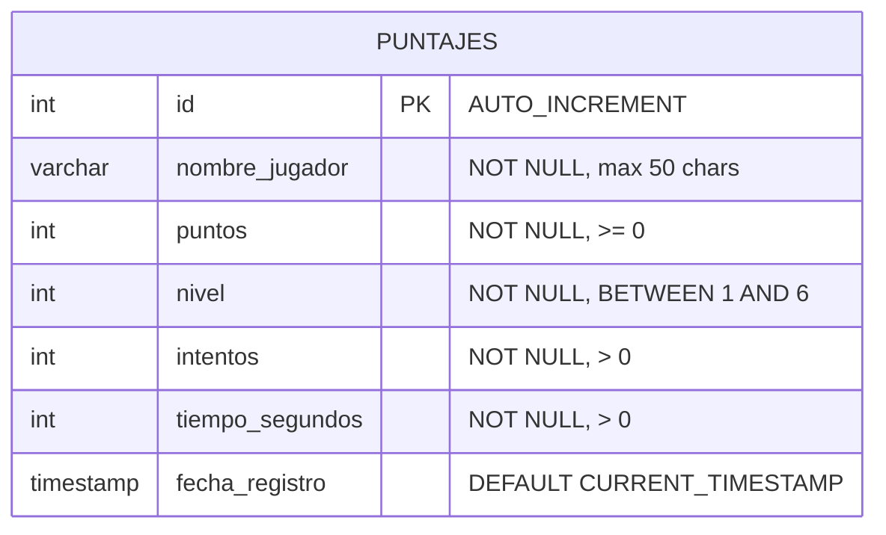

# Esquema de Base de Datos — guessrule

## Descripción general

La base de datos `guessrule` almacena los resultados de las partidas del juego.
Actualmente contiene una sola tabla: `puntajes`.

---

## Diagrama ERD

> Copiar en [dbdiagram.io](https://dbdiagram.io) o en cualquier editor Mermaid.



---

## Tabla: puntajes

| Campo | Tipo | Nulo | Restricción | Descripción |
|---|---|---|---|---|
| `id` | INT | NO | PK, AUTO_INCREMENT | Identificador único del registro |
| nombre_jugador | VARCHAR(50) | NO | NOT NULL | Nombre del jugador |
| `puntos` | INT | NO | >= 0 | Puntuación obtenida en la partida |
| `nivel` | INT | NO | BETWEEN 1 AND 6 | Nivel jugado |
| `intentos` | INT | NO | > 0 | Número de intentos usados |
| `tiempo_segundos` | INT | NO | > 0 | Duración de la partida en segundos |
| `fecha_registro` | TIMESTAMP | SÍ | DEFAULT NOW() | Fecha y hora de la partida |

---

## Restricciones (CHECK constraints)

| Nombre | Condición | Motivo |
|---|---|---|
| `chk_puntos_positivos` | `puntos >= 0` | No existen puntajes negativos |
| `chk_nivel_valido` | `nivel BETWEEN 1 AND 6` | El juego tiene exactamente 6 niveles |
| `chk_intentos_positivos` | `intentos > 0` | Toda partida tiene al menos 1 intento |
| `chk_tiempo_positivo` | `tiempo_segundos > 0` | El tiempo siempre es mayor a cero |

---

## Índices

| Nombre | Columna | Orden | Uso |
|---|---|---|---|
| `idx_puntos_desc` | `puntos` | DESC | Ranking por puntaje |
| `idx_fecha` | `fecha_registro` | DESC | Historial de partidas recientes |

---

## Diagrama de flujo de pruebas


---

## Archivos del repositorio

| Archivo | Descripción |
|---|---|
| `database/schema.sql` | Script de creación de la base de datos y tabla |
| `database/test_schema.sql` | Script de pruebas positivas y negativas |

---

## Cómo ejecutar

### Crear la base de datos

```sql
-- En MySQL Workbench: File > Open SQL Script > schema.sql
-- Luego: Query > Execute All
source database/schema.sql;
```

### Probar restricciones

```sql
-- Ejecutar después de schema.sql
-- Las pruebas N1-N7 deben generar errores — eso es el comportamiento correcto
source database/test_schema.sql;
```

### Errores esperados en las pruebas negativas

| Prueba | Error MariaDB | Causa |
|---|---|---|
| N1 – puntos = -1 | ERROR 4025: Check constraint violated | `chk_puntos_positivos` |
| N2 – nivel = 0 | ERROR 4025: Check constraint violated | `chk_nivel_valido` |
| N3 – nivel = 7 | ERROR 4025: Check constraint violated | `chk_nivel_valido` |
| N4 – intentos = 0 | ERROR 4025: Check constraint violated | `chk_intentos_positivos` |
| N5 – tiempo = 0 | ERROR 4025: Check constraint violated | `chk_tiempo_positivo` |
| N6 – nombre_jugador NULL | ERROR 1048: Column cannot be null | NOT NULL en nombre_jugador |
| N7 – puntos NULL | ERROR 1048: Column cannot be null | NOT NULL en `puntos` |
