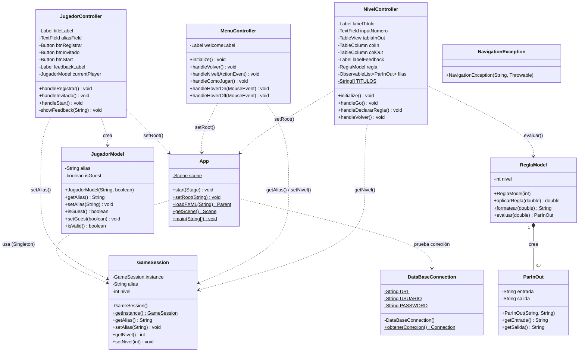

# Diagrama de Clases – Guess My Rule

## Descripción general

El sistema se divide en tres capas principales siguiendo el patrón MVC:

- **Capa de Aplicación**: `App` y `GameSession` (Singleton de estado global)
- **Capa de Controladores (MVC – Controller)**: `JugadorController`, `MenuController`, `NivelController`
- **Capa de Modelos (MVC – Model)**: `JugadorModel`, `ReglaModel`, `ParInOut` (inner class)
- **Capa de Utilidades**: `DataBaseConnection`, `NavigationException`

## Diagrama

## Descripción de clases

### App
Punto de entrada de la aplicación JavaFX. Carga las fuentes, prueba la conexión a BD y gestiona la navegación entre vistas FXML mediante `setRoot()`.

### GameSession (Singleton)
Almacena el estado global de la sesión actual: alias del jugador y nivel seleccionado. Implementa el patrón Singleton para garantizar una única instancia.

### JugadorController
Controla la pantalla de registro del jugador. Valida el alias, crea el `JugadorModel` y guarda el alias en `GameSession` antes de navegar al menú.

### MenuController
Controla la pantalla de selección de nivel. Lee el alias de `GameSession` para el mensaje de bienvenida y navega al nivel seleccionado.

### NivelController
Controla la pantalla de juego. Delega al `ReglaModel` la lógica de evaluación y muestra los pares entrada/salida en la tabla.

### JugadorModel
Modelo de datos del jugador: alias y si es invitado. Incluye validación básica del alias.

### ReglaModel
Contiene la lógica de las 6 reglas matemáticas según el nivel. Evalúa entradas y retorna `ParInOut`.

### ParInOut (inner class de ReglaModel)
Representa un par entrada→salida generado por la regla. Usado por `NivelController` para poblar la tabla.

### DataBaseConnection
Utilidad estática para obtener la conexión JDBC a MySQL/MariaDB.

### NavigationException
Excepción de runtime para errores de navegación entre vistas FXML.
