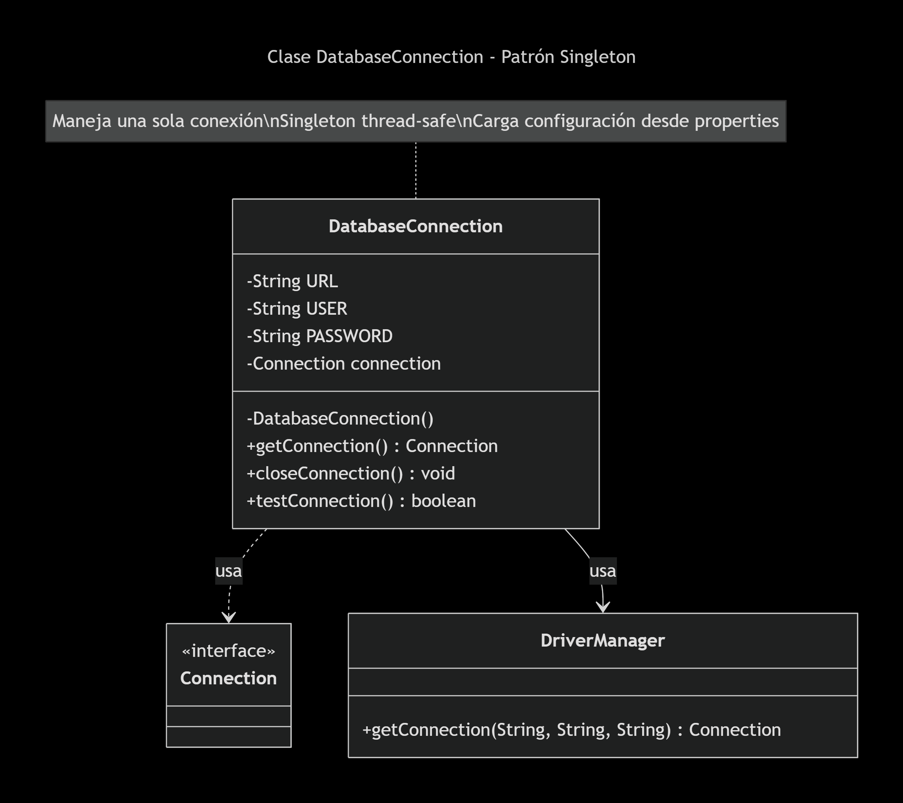
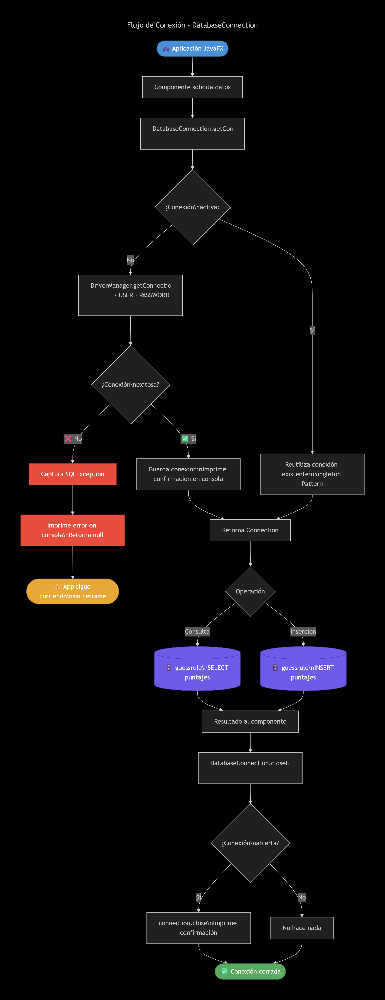

# Conexión JDBC — guessrule

## Descripción general

La clase `DatabaseConnection` provee una conexión centralizada entre la aplicación
JavaFX y la base de datos `guessrule` usando JDBC.

---

## Diagrama de clases



---

## Diagrama de flujo de conexión



---

## Parámetros de conexión (GMR1-156)

| Parámetro | Valor |
|---|---|
| URL | `jdbc:mysql://localhost:3306/guessrule` |
| Usuario | `root` |
| Contraseña | *(vacía — configuración XAMPP por defecto)* |
| Driver | MySQL Connector/J 8.3.0 |

---

## Cómo usar la clase

```java
// Obtener conexión
Connection conn = DatabaseConnection.getConnection();

// Probar conexión
boolean ok = DatabaseConnection.testConnection();

// Cerrar conexión al terminar
DatabaseConnection.closeConnection();
```

---

## Manejo de errores (GMR1-158)

| Situación | Comportamiento |
|---|---|
| Base de datos no disponible | Captura `SQLException`, imprime mensaje, retorna `null` |
| Credenciales incorrectas | Captura `SQLException`, imprime mensaje, retorna `null` |
| Conexión ya abierta | Reutiliza la conexión existente (Singleton) |
| Error al cerrar | Captura `SQLException`, imprime mensaje |

La aplicación **nunca cierra inesperadamente** ante un fallo de conexión.

---

## Archivos del repositorio

| Archivo | Descripción |
|---|---|
| `src/main/java/com/example/util/DatabaseConnection.java` | Clase de conexión JDBC |
| `database/test_connection.sql` | Script de verificación de conexión |
| `pom.xml` | Dependencia MySQL Connector/J 8.3.0 |
